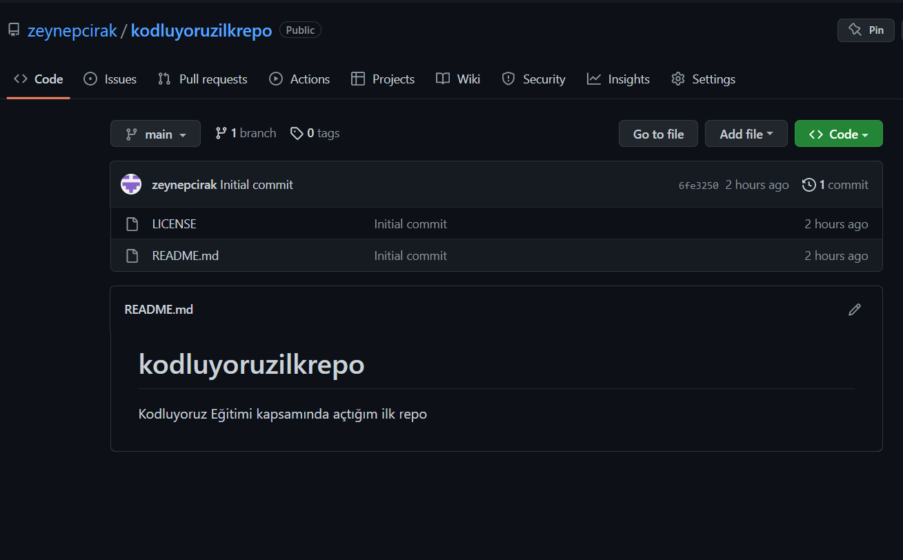

# Kodluyoruz İlk Repo

Bu repo [Kodluyoruz](https://kodluyoruz.org/tr/kodluyoruz/)    Front-End Eğitiminde oluşturduğumuz ilk repo, içerisinde bir adet README dosyası, bir adet de index.html barındırıyor.


<<<<<<< HEAD

=======

>>>>>>> 09c64f7fb5bb8034c06b34d3c59948040ce0b8ff

  

## Installation

Öncelikle projeyi clonelayın.(Buraya sizin reponuzdan aldığınız link gelecek)

  

````

git clone https://github.com/zeynepcirak/kodluyoruzilkrepo.git

  ````


## Usage

Projeyi cloneladıktan sonra Visual Studio Code programında açınız.

  

Linux için:

  

````

cd kodluyoruzilrepo

code .

````

## Contributing

Pull requestler kabul edilir.Büyük değişiklikler için lütfen önce neyi değiştirmek istediğinizi tartışmak için bir konu açınız.

  

## License

[MIT](https://opensource.org/licenses/MIT)


